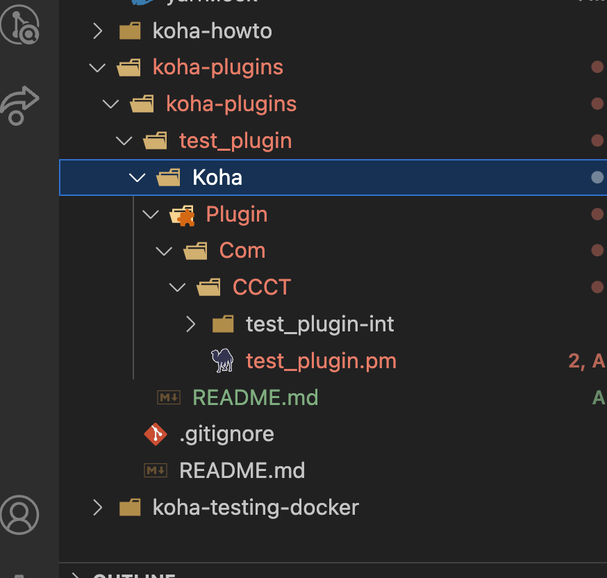

This test_plugin is a very small plugin to for proof of concept and testing.

It's based on the [Kitchen Sink plugin](https://github.com/bywatersolutions/dev-koha-plugin-kitchen-sink/tree/master) with
all but a few front-end options commented out.

The test_plugin.kpz file can be uploaded via the [Koha staff GUI](http://localhost:8081/cgi-bin/koha/plugins/plugins-home.pl), and then it can be enabled.

The folder structure is important for building the plugin. Additional folders and file can be added in the test_plugin-int folder, but this folder structure seems to be important for the build process: Koha\Plugin\Com\some_company_name\{files needed}. Refer to the Kitchen Sink repo for more ideas.

Once your happy with your plugin or want to upload it for testing, compress the Koha folder, and change the extenion from .zip to .kpz. You can upload the zipped files via the GUI mentioned above to test your changes. Note: this command may do what we need: `git archive --output=../koha-plugin.kpz --format=zip HEAD -- Koha`
